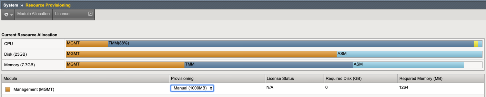

# OpenShift FAQ for Container Ingress Controller

## OpenShift node install with multiple interfaces

**Problem:** CIS takes the node ip information from kube api in cluster mode. It should actually take these details from flannel as CIS creates the fdb entries in BIG-IP using these details. This issue is only seen when the nodes are multiple interfaces. 

**Solution:** Use Flannel annotations to get the node ip addresses. Add a new annotation for mac address and public IP. This needs to get added to each node. Please find the required annotations below. MAC address of the vxlan interface of that particular node.

```
    flannel.alpha.coreos.com/backend-data: '{"VtepMAC":"<MAC>"}'
    flannel.alpha.coreos.com/public-ip: “<IP>”
```
In OpenShift edit the nodes yaml

```
oc get nodes -o yaml
and edit the yaml to add the annotations and apply
```
Github issue https://github.com/F5Networks/k8s-bigip-ctlr/issues/797

---

## restjavad memory recommendation using CIS and AS3

**Solution:** It is recommended to increase restjavad memory provisioning when using CIS with AS3. The re-provisioning of memory will trigger a restart of the services

Increase memory assigned to 1GB the BIGIP:
```
tmsh modify sys db provision.extramb value 1000
```
Allow restjavad to access the extra memory:
```
tmsh modify sys db restjavad.useextramb value true
```
Save the config:
```
tmsh save sys config
```
Wait until the unit is online again. Increase the restjavad maxMessageBodySize property using the following curl command:
```
curl -s -f -u admin: -H "Content-Type: application/json" -d '{"maxMessageBodySize":134217728}' -X POST http://localhost:8100/mgmt/shared/server/messaging/settings/8100
```

Image below displays the manual resource provisioning



---

## What subnet to use for the Self-IP's on BIG-IP

We can use any subnet for self-IPs in BIG-IP other than the cluster network. But for the cluster network we can use any subnet (/14,/15 etc) because to be in the same network as the cluster is listening to. In fact to communicate with the k8s/ openshift cluster without networking issues.
 
For example in our regular testing:
 
BIGIP is configured with selfIP: 10.131.255.1 with subnet 255.252.0.0(/14). See the pic below for more details. With this we can calculate our host subnet range as : 10.128.0.1 - 10.131.255.254


 
But our cluster(openshift or k8s) is listening on below Cluster network (see the highlighted one below):
 
```
openshift$ oc get hostsubnets
NAME            HOST            HOST IP         SUBNET            EGRESS CIDRS   EGRESS         bigip           bigip                                     172.16.1.23   10.131.255.0/31   
cosmic-master.example.com    cosmic-master.example.com    172.16.1.3    10.128.0.0/23
cosmic-worker0.example.com   cosmic-worker0.example.com   172.16.1.11   10.128.6.0/23
cosmic-worker1.example.com   cosmic-worker1.example.com   172.16.1.9    10.130.4.0/23
```
So, in order to communicate with the nodes in ClusterIP the BIG-IP selfIP should be in this range. So we configured with /14 to allow host subnet range i.e. 10.128.0.1 - 10.131.255.254.
And as we know the pod uses the same network as it is highlighted below based on the node it is getting deployed.